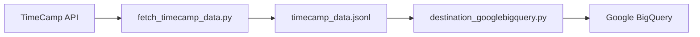

# TimeCamp Data Pipeline

A data pipeline to extract time entries from TimeCamp and load them into Google BigQuery.

## Setup

1. Clone the repository
2. Install dependencies:
```bash
pip3 install -r requirements.txt
```
3. Copy `.env.sample` to `.env` and fill in your API keys and BigQuery configuration:
```bash
cp .env.sample .env
```

## Google BigQuery Configuration

To use the BigQuery integration, you need to:

1. Create a Google Cloud project if you don't have one already
2. Enable the BigQuery API in your project
3. Create a service account with the following permissions:
   - `roles/bigquery.dataEditor` - Allows creating and modifying tables and data
   - `roles/bigquery.user` - Allows using the BigQuery service
   - `roles/bigquery.jobUser` - Allows running BigQuery jobs (needed for data loading)
4. Create Key and download the service account JSON key file
5. Update the following in your `.env` file:
   - `GOOGLE_APPLICATION_CREDENTIALS`: Path to your service account JSON file
   - `GOOGLE_CLOUD_PROJECT`: Your Google Cloud project ID
   - `BIGQUERY_DATASET`: The BigQuery dataset ID where data will be stored
   - `BIGQUERY_TABLE`: The table name for TimeCamp data (default: timecamp_entries)

### Dataset Preparation

The script will automatically create the table if it doesn't exist, but you must create the dataset manually:

1. Go to the BigQuery console in Google Cloud
2. Select your project
3. Click "Create Dataset"
4. Enter the dataset ID that matches your `BIGQUERY_DATASET` value
5. Select appropriate location and settings for your needs
6. Click "Create Dataset"

## Usage

### Fetching TimeCamp Data

```bash
# Fetch yesterday's entries (default, JSONL format)
python fetch_timecamp_data.py

# Choose output format (JSONL is optimized for BigQuery)
python fetch_timecamp_data.py --format json   # Pretty JSON format
python fetch_timecamp_data.py --format jsonl  # Newline-delimited JSON (default)

# Fetch entries for a specific date range
python fetch_timecamp_data.py --from "2023-04-01" --to "2023-04-30"

# Enable debug mode
python fetch_timecamp_data.py --debug

# Specify output file
python fetch_timecamp_data.py --output custom_filename.jsonl
```

### Uploading to BigQuery

```bash
# Upload data to BigQuery
python destination_googlebigquery.py
```

The BigQuery upload script:
- Uses the environment variables from your `.env` file
- Automatically detects and reads from `timecamp_data.jsonl` (or falls back to `timecamp_data.json`)
- Uses an upsert pattern to update existing records or insert new ones based on the entry ID
- Optimizes the upload process by directly loading JSONL files

## Data Flow Optimization

The pipeline is optimized for efficiency:
1. `fetch_timecamp_data.py` saves data in JSONL format by default (newline-delimited JSON)
2. `destination_googlebigquery.py` can directly upload JSONL files to BigQuery without transformation
3. This eliminates the need for intermediate data conversion, making the pipeline faster and more efficient

## Incremental Updates

The BigQuery upload process uses a sophisticated upsert (update/insert) pattern:

1. Data is first loaded into a temporary BigQuery table
2. A SQL MERGE operation is performed that:
   - Updates existing records if the entry ID already exists in the target table
   - Inserts new records if the entry ID doesn't exist yet
3. The temporary table is automatically deleted after the operation

This approach ensures that:
- Existing records are updated with the latest data from TimeCamp
- New records are added to the table
- No duplicate entries are created
- Historical data is preserved

## System Architecture



## Crontab Setup

To automate the data pipeline, you can set up a cron job:

```bash
# Example: Run daily at 1:00 AM
0 1 * * * cd /path/to/repository && python fetch_timecamp_data.py && python destination_googlebigquery.py
```

## License

MIT